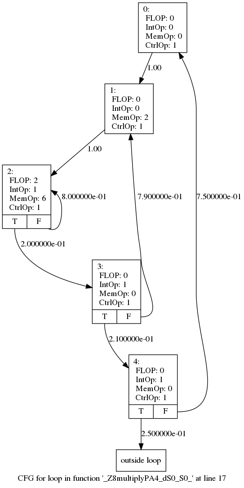

# CFGPass
An LLVM plugin for generating control flow graph (CFG) with detail information. 

## Requirements
LLVM (Clang) 3.9 or later, CMake

## Installation
```
	$ cd CFGPass
	$ mkdir build 
	$ cd build
	$ cmake ..
	$ make
```

## Usage

### Prepare target program
1. Instrument source file by Clang-3.9:

```
	clang++-3.9 -O1 -fprofile-instr-generate HelloWorld.C -o HelloWorld_instru
```

2. Run executable to generate profile data:

```
	LLVM_PROFILE_FILE="code-%p.profraw" ./HelloWorld_instru
```

3. Merge profile data from multiple runs:

```
llvm-profdata merge -output=code.profdata code-*.profraw
```

4. Apply profile data to generate bitcode:

```
clang++-3.9 -O1 -c -g -emit-llvm -fprofile-instr-use=code.profdata -o HelloWorld.instru.bc HelloWorld.C
```

5. Generate readably assembly (Optional):

```
clang++-3.9 -S -emit-llvm -fprofile-instr-use=code.profdata -o HelloWorld.instru.ll HelloWorld.c
```

### Generate CFG

```
opt-3.9 -load cfgpass/libCfgPass.so -test -disable-output HelloWorld.instru.bc
```

## Output

### Format
CFGPass generates data in two formats to describe the target program: matrix and DOT file

For a CFG with N nodes (basic blocks), it will be an NxN matrix generated. Each row consists of instruction mix (four categories, separated by :) and transition probability (separated by tab) from one node to others. For instance, one row might look like following:

```
20:1:12:0	0	0.25	0.75
```
It represents that this CFG node contains 20 floating-point operations, 1 memory operation, 12 control operations, and nointeger operation. Also, it indicates that this node has two adjacent nodes, one with 25% transition probability and 75% for the other. 

### Example
In this section, we use an example to demonstrate the output of CFGPass.

```cpp
void multiply(double mat1[][N],  
              double mat2[][N],  
              double res[][N]) 
{ 
    int i, j, k; 
    for (i = 0; i < N; i++) 
    { 
        for (j = 0; j < N; j++) 
        { 
            res[i][j] = 0.0; 
            for (k = 0; k < N; k++) 
                res[i][j] += mat1[i][k] *  
                             mat2[k][j]; 
        } 
    } 
} 
```
This code snippet is the core part of matrix multiplication. The generated DOT format shows as follows (in PNG):


Corresponding output in matrix (first line indicates the number of nodes):
```
5
0:0:1:0	0.000000e+00	1.000000e+00	0.000000e+00	0.000000e+00	0.000000e+00	
0:2:1:0	0.000000e+00	0.000000e+00	1.000000e+00	0.000000e+00	0.000000e+00	
2:6:1:1	0.000000e+00	0.000000e+00	8.000000e-01	2.000000e-01	0.000000e+00	
0:0:1:1	0.000000e+00	7.900000e-01	0.000000e+00	0.000000e+00	2.100000e-01	
0:0:1:1	7.500000e-01	2.500000e-01	0.000000e+00	0.000000e+00	0.000000e+00	
```
A [script](script/csvConverter.py) is provided to convert this plain-text matrix to csv format.

